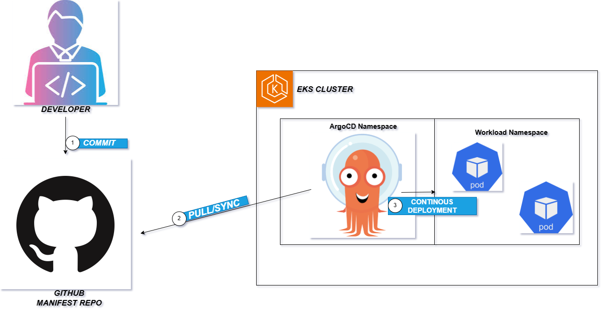
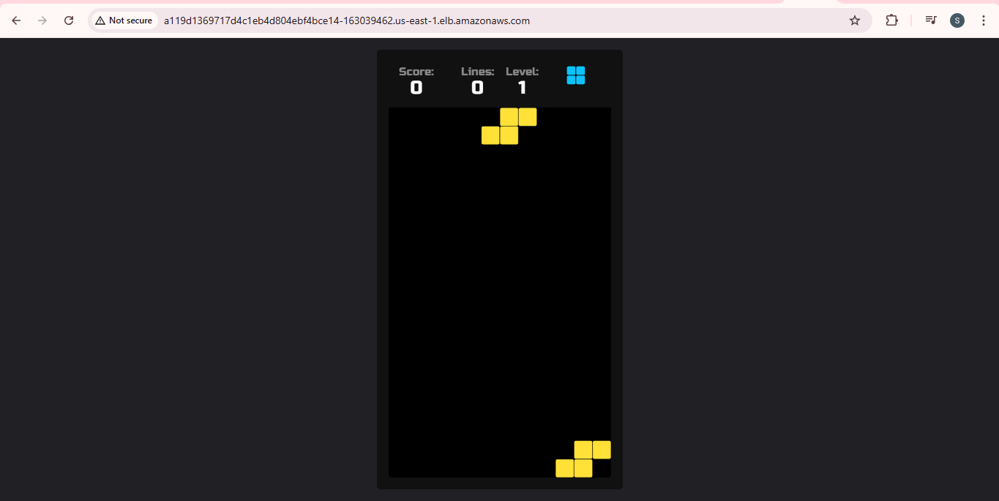
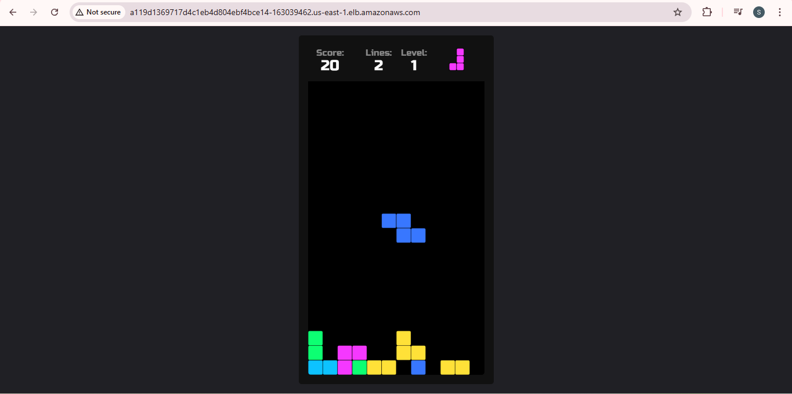
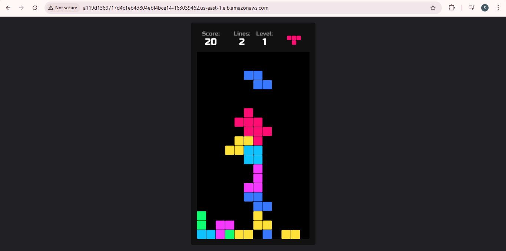
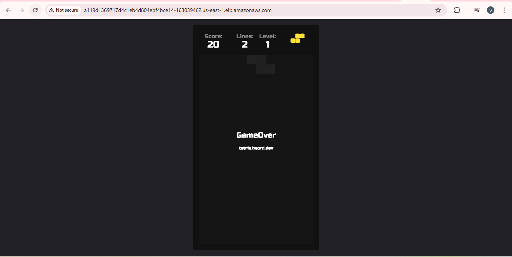
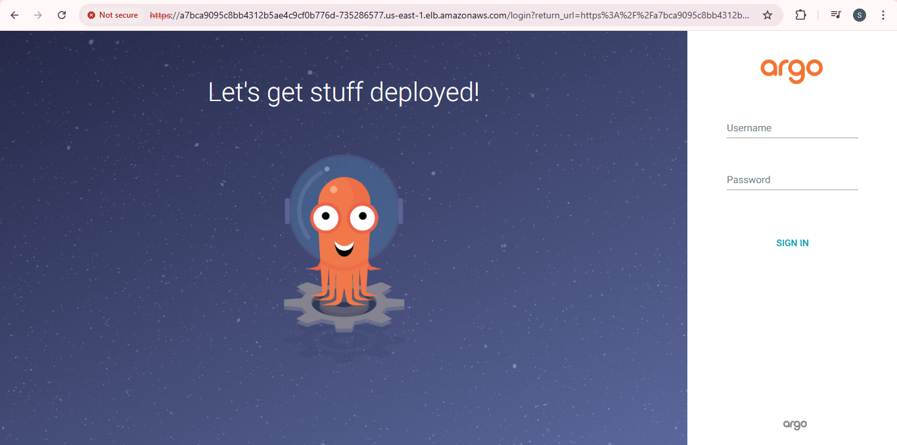
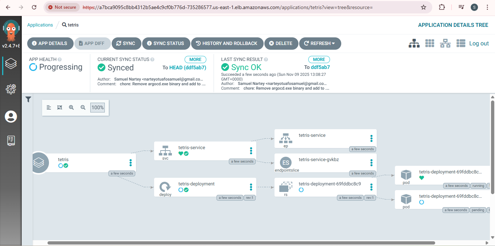
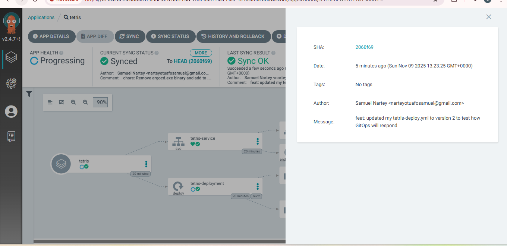
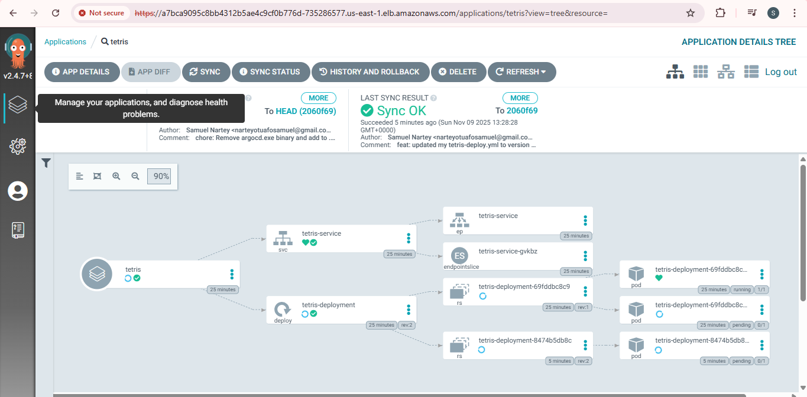

# GitOps Tetris Project

A Kubernetes-based deployment of the classic Tetris game using GitOps principles. This project demonstrates container orchestration and service management with Kubernetes manifests.

## Project Overview

This repository contains Kubernetes manifests for deploying a Tetris game application in a Kubernetes cluster. It showcases GitOps best practices with declarative configuration management.

## Architecture

### Architecture Diagram



### Architecture Flow

The GitOps Tetris project follows a complete automated deployment workflow:

1. **Git Repository** - Configuration is stored in Git as the single source of truth
2. **ArgoCD Monitoring** - ArgoCD continuously monitors the Git repository for changes
3. **Change Detection** - When manifests are updated in Git, ArgoCD detects the differences
4. **Kubernetes Deployment** - ArgoCD automatically syncs the desired state to the Kubernetes cluster
5. **Pod Management** - Kubernetes creates and manages Tetris game pods based on deployment specifications
6. **Service Exposure** - The LoadBalancer service exposes the Tetris game to external users
7. **User Access** - Users access the game through the external IP provided by the LoadBalancer

### Components

- **Tetris Deployment** (`tetris-deploy.yaml`)
  - Deploys 2 replicas of the Tetris application
  - Uses the `nasi101/tetrisv2` Docker image
  - Exposes port 80 for HTTP traffic

- **Tetris Service** (`tetris-svc.yaml`)
  - LoadBalancer service for external access
  - Routes traffic to Tetris pods on port 80
  - Enables load balancing across replicas

- **ArgoCD**
  - GitOps operator for continuous deployment
  - Monitors Git repository for configuration changes
  - Automatically syncs desired state to Kubernetes cluster
  - Provides centralized UI for deployment management

## File Structure

```
GitOps_p1/
├── README.md                 # This file
├── manifest/
│   ├── tetris-deploy.yaml    # Deployment configuration
│   ├── tetris-svc.yaml       # Service configuration
└── Screenshots/              # Project documentation images
```

## Prerequisites

- Kubernetes cluster (v1.19+)
- `kubectl` configured to access your cluster
- Docker (for building custom images, if needed)

## Deployment

### Quick Start

Deploy the Tetris application to your Kubernetes cluster:

```bash
# Apply all manifests
kubectl apply -f manifest/

# Verify deployment
kubectl get deployments
kubectl get services
kubectl get pods
```

### Access the Application

Once deployed, the Tetris game is accessible via the LoadBalancer service:

```bash
# Get the external IP
kubectl get svc tetris-service -w

# Access the game at: http://<EXTERNAL-IP>
```

### Scaling

Adjust the number of replicas in `tetris-deploy.yaml`:

```yaml
spec:
  replicas: 3  # Change this value
```

Then reapply:

```bash
kubectl apply -f manifest/tetris-deploy.yaml
```

## Configuration

### Deployment Configuration (`tetris-deploy.yaml`)

- **Replicas**: 2 (configurable)
- **Image**: `nasi101/tetrisv2`
- **Port**: 80
- **Selector**: `app: tetris`

### Service Configuration (`tetris-svc.yaml`)

- **Type**: LoadBalancer
- **Port**: 80
- **Target Port**: 80
- **Selector**: `app: tetris`

## Customization

### Change Image Version

Edit `manifest/tetris-deploy.yaml`:

```yaml
containers:
  - name: tetris
    image: nasi101/tetrisv2:latest  # Update tag as needed
```

### Modify Service Type

Edit `manifest/tetris-svc.yaml` to use NodePort or ClusterIP instead of LoadBalancer:

```yaml
type: NodePort  # or ClusterIP
```

## Troubleshooting

### Check Deployment Status

```bash
kubectl describe deployment tetris-deployment
kubectl describe pod <pod-name>
```

### View Logs

```bash
kubectl logs -f deployment/tetris-deployment
```

### Verify Service

```bash
kubectl describe svc tetris-service
```

## Cleanup

Remove all resources:

```bash
kubectl delete -f manifest/
```

## Deployment Success

### Tetris Game Deployment

The following screenshots show the successful deployment of the Tetris game on Kubernetes:









### ArgoCD Interface

ArgoCD monitoring and syncing the Tetris application:











## GitOps Best Practices

This project follows GitOps principles:
- **Declarative Configuration**: All infrastructure defined in YAML manifests
- **Version Control**: Configuration tracked in Git
- **Single Source of Truth**: Manifests are the authoritative state
- **Automated Deployment**: Apply changes via GitOps operators (ArgoCD, Flux, etc.)

## Future Enhancements

- Add Ingress configuration for custom domain support
- Implement HorizontalPodAutoscaler for dynamic scaling
- Add persistent storage for game state
- Configure resource requests and limits
- Add health checks (liveness and readiness probes)
- Implement network policies for security

## License

This project is part of the 12-week challenge personal project series.

## Author

samuel-nartey

## References

- [Kubernetes Documentation](https://kubernetes.io/docs/)
- [GitOps Best Practices](https://www.gitops.tech/)
- [Tetris Game](https://en.wikipedia.org/wiki/Tetris)

---

**Last Updated**: November 11, 2025
