# GitOps Tetris Project - Complete Setup Guide# GitOps Tetris Project


A comprehensive guide to deploying the classic Tetris game on AWS EKS using GitOps principles with ArgoCD. This project demonstrates containerization, Kubernetes orchestration, and continuous deployment workflows.A Kubernetes-based deployment of the classic Tetris game using GitOps principles. This project demonstrates container orchestration and service management with Kubernetes manifests.


## Table of Contents## Project Overview


1. [Project Overview](#project-overview)This repository contains Kubernetes manifests for deploying a Tetris game application in a Kubernetes cluster. It showcases GitOps best practices with declarative configuration management.

2. [Architecture](#architecture)

3. [Prerequisites](#prerequisites)## Architecture

4. [Step-by-Step Setup Guide](#step-by-step-setup-guide)

   - [Step 1: Create EKS Cluster](#step-1-create-eks-cluster)### Architecture Diagram

   - [Step 2: Create Node Group](#step-2-create-node-group)

   - [Step 3: Configure kubectl](#step-3-configure-kubectl)

   - [Step 4: Install ArgoCD](#step-4-install-argocd)

   - [Step 5: Access ArgoCD Dashboard](#step-5-access-argocd-dashboard)### Architecture Flow

   - [Step 6: Connect GitHub Repository](#step-6-connect-github-repository)

   - [Step 7: Create ArgoCD Application](#step-7-create-argocd-application)The GitOps Tetris project follows a complete automated deployment workflow:

   - [Step 8: Verify Deployment](#step-8-verify-deployment)

5. [ArgoCD Dashboard Guide](#argocd-dashboard-guide)1. **Git Repository** - Configuration is stored in Git as the single source of truth

6. [Project Structure](#project-structure)2. **ArgoCD Monitoring** - ArgoCD continuously monitors the Git repository for changes

7. [Troubleshooting](#troubleshooting)3. **Change Detection** - When manifests are updated in Git, ArgoCD detects the differences

8. [References](#references)4. **Kubernetes Deployment** - ArgoCD automatically syncs the desired state to the Kubernetes cluster

5. **Pod Management** - Kubernetes creates and manages Tetris game pods based on deployment specifications

---6. **Service Exposure** - The LoadBalancer service exposes the Tetris game to external users

7. **User Access** - Users access the game through the external IP provided by the LoadBalancer

## Project Overview

### Components

This project demonstrates GitOps best practices by:

- Creating an AWS EKS (Elastic Kubernetes Service) cluster- **Tetris Deployment** (`tetris-deploy.yaml`)

- Setting up ArgoCD as a GitOps operator  - Deploys 2 replicas of the Tetris application

- Automating Tetris application deployment  - Uses the `nasi101/tetrisv2` Docker image

- Maintaining Git as the single source of truth  - Exposes port 80 for HTTP traffic

- Enabling continuous deployment through Git commits

- **Tetris Service** (`tetris-svc.yaml`)

---  - LoadBalancer service for external access

  - Routes traffic to Tetris pods on port 80

## Architecture  - Enables load balancing across replicas


### Architecture Diagram- **ArgoCD**

  - GitOps operator for continuous deployment

  - Monitors Git repository for configuration changes

  - Automatically syncs desired state to Kubernetes cluster

### Architecture Flow  - Provides centralized UI for deployment management


The GitOps Tetris project follows this automated workflow:## File Structure


1. **Git Repository** - Configuration stored in Git as the single source of truth```

2. **ArgoCD Monitoring** - ArgoCD continuously monitors the Git repository for changesGitOps_p1/

3. **Change Detection** - When manifests are updated in Git, ArgoCD detects the differences├── README.md                 # This file

4. **Kubernetes Deployment** - ArgoCD automatically syncs the desired state to the Kubernetes cluster├── manifest/

5. **Pod Management** - Kubernetes creates and manages Tetris game pods based on deployment specifications│   ├── tetris-deploy.yaml    # Deployment configuration

6. **Service Exposure** - The LoadBalancer service exposes the Tetris game to external users│   ├── tetris-svc.yaml       # Service configuration

7. **User Access** - Users access the game through the external IP provided by the LoadBalancer└── Screenshots/              # Project documentation images

```

---

## Prerequisites

## Prerequisites

- Kubernetes cluster (v1.19+)

- AWS Account with appropriate permissions- `kubectl` configured to access your cluster

- AWS CLI installed and configured- Docker (for building custom images, if needed)

- `kubectl` (Kubernetes command-line tool)

- `eksctl` (EKS cluster management tool) or AWS Console access## Deployment

- Git installed

- GitHub account with a repository### Quick Start


---Deploy the Tetris application to your Kubernetes cluster:


## Step-by-Step Setup Guide```bash

# Apply all manifests

### Step 1: Create EKS Clusterkubectl apply -f manifest/


#### 1.1 Using AWS Console# Verify deployment

kubectl get deployments

Navigate to EKS in AWS Console and create a new cluster with the following specifications:kubectl get services

kubectl get pods

**Cluster Configuration:**```

- **Cluster Name**: tetris-cluster (or your preferred name)

- **Kubernetes Version**: 1.27+ (recommended)### Access the Application

- **Cluster Service Role**: Create or select an IAM role with EKS service permissions

Once deployed, the Tetris game is accessible via the LoadBalancer service:

**Cluster IAM Role Requirements:**

The role should have the following policies:```bash

- `AmazonEKSClusterPolicy`# Get the external IP

- `AmazonEKSVPCResourceController`kubectl get svc tetris-service -w


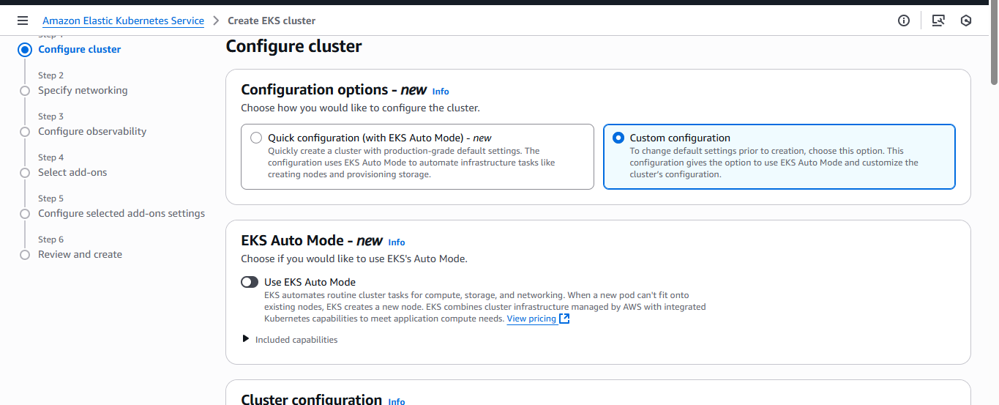# Access the game at: http://<EXTERNAL-IP>

```

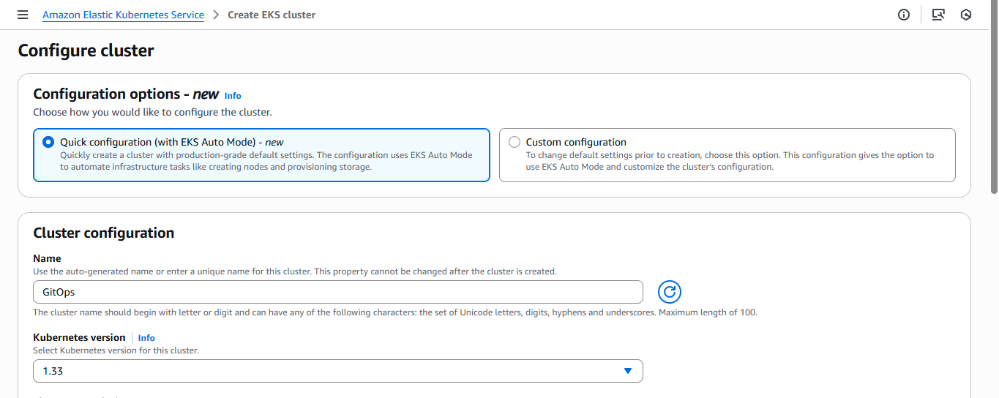

### Scaling

#### 1.2 Networking Configuration

Adjust the number of replicas in `tetris-deploy.yaml`:

Configure VPC and subnet settings:

```yaml

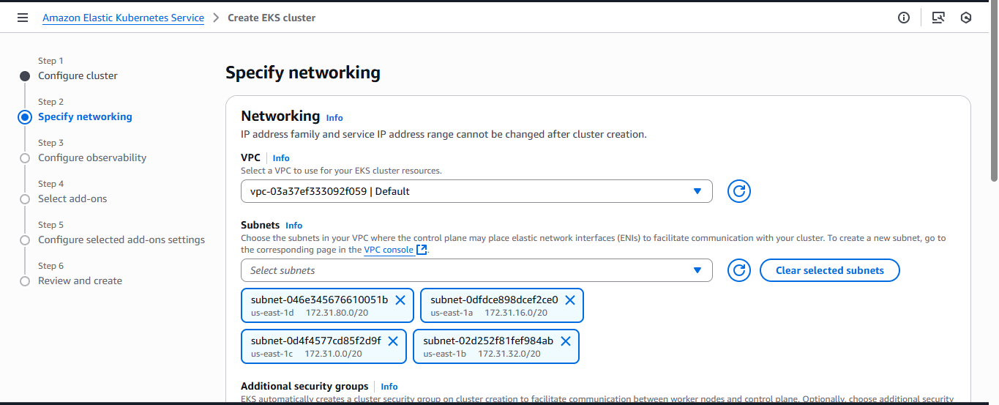spec:

  replicas: 3  # Change this value

#### 1.3 IAM Role Setup```


Set up the cluster IAM role with required permissions:Then reapply:


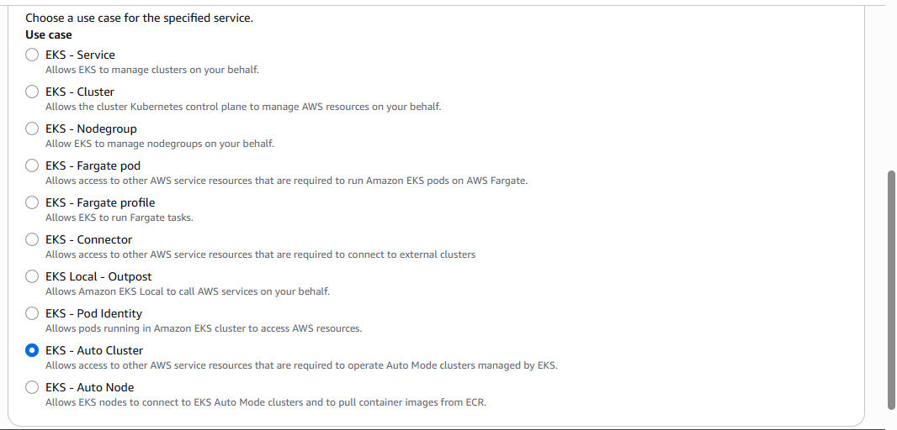```bash

kubectl apply -f manifest/tetris-deploy.yaml

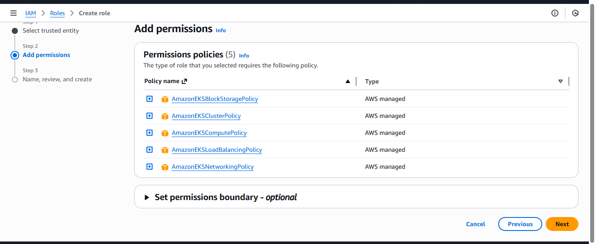```


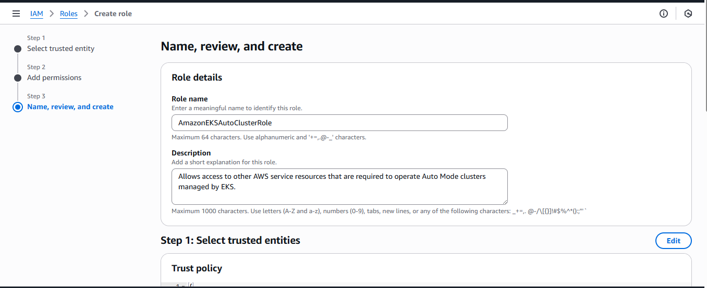## Configuration


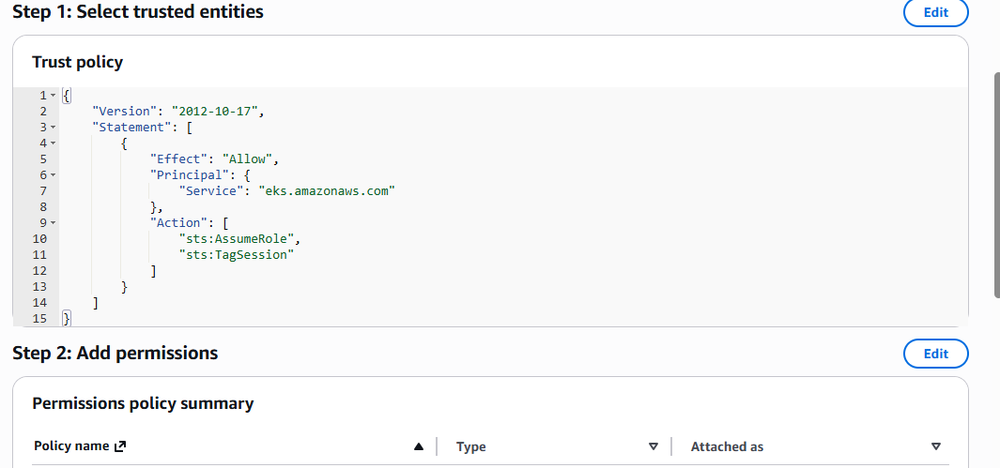### Deployment Configuration (`tetris-deploy.yaml`)


#### 1.4 Review and Create- **Replicas**: 2 (configurable)

- **Image**: `nasi101/tetrisv2`

Review your cluster configuration before creation:- **Port**: 80

- **Selector**: `app: tetris`

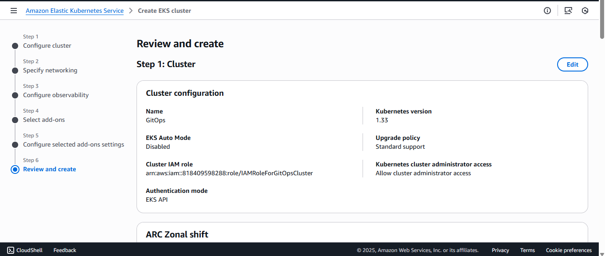

### Service Configuration (`tetris-svc.yaml`)

#### 1.5 Final Creation Status

- **Type**: LoadBalancer

Wait for the cluster to be created (this typically takes 10-15 minutes):- **Port**: 80

- **Target Port**: 80

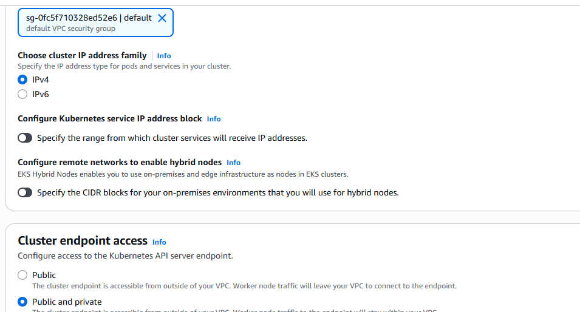- **Selector**: `app: tetris`


---## Customization


### Step 2: Create Node Group### Change Image Version


#### 2.1 Add Node Group to ClusterEdit `manifest/tetris-deploy.yaml`:


After the cluster is created, add a node group to host your workloads.```yaml

containers:

**Node Group Configuration:**  - name: tetris

- **Node Group Name**: tetris-node-group    image: nasi101/tetrisv2:latest  # Update tag as needed

- **Node IAM Role**: Create a new role or select existing```


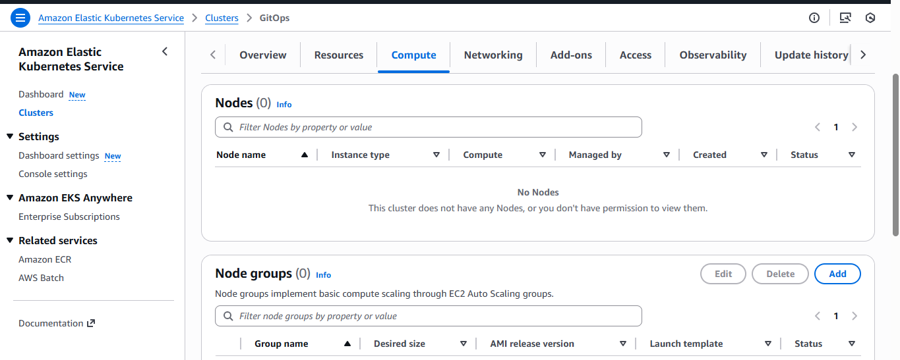### Modify Service Type


#### 2.2 Node IAM Role SetupEdit `manifest/tetris-svc.yaml` to use NodePort or ClusterIP instead of LoadBalancer:


The node role requires the following policies:```yaml

- `AmazonEKSWorkerNodePolicy`type: NodePort  # or ClusterIP

- `AmazonEKS_CNI_Policy````

- `AmazonEC2ContainerRegistryReadOnly`

## Troubleshooting

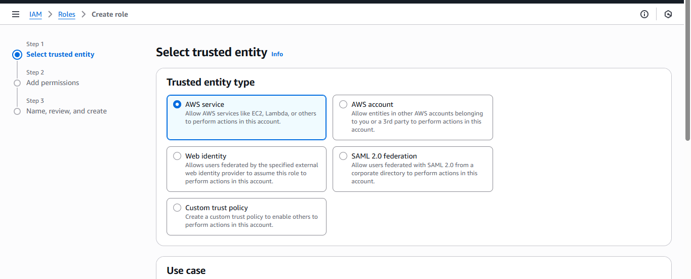

### Check Deployment Status

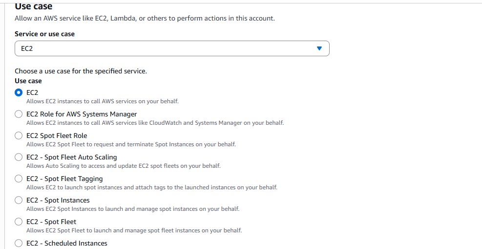

```bash

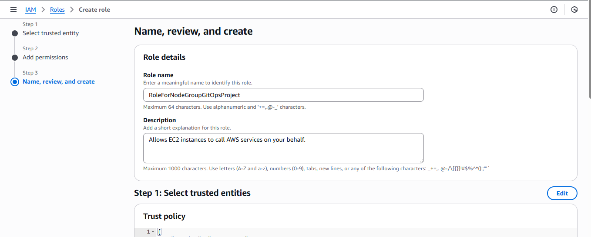kubectl describe deployment tetris-deployment

kubectl describe pod <pod-name>

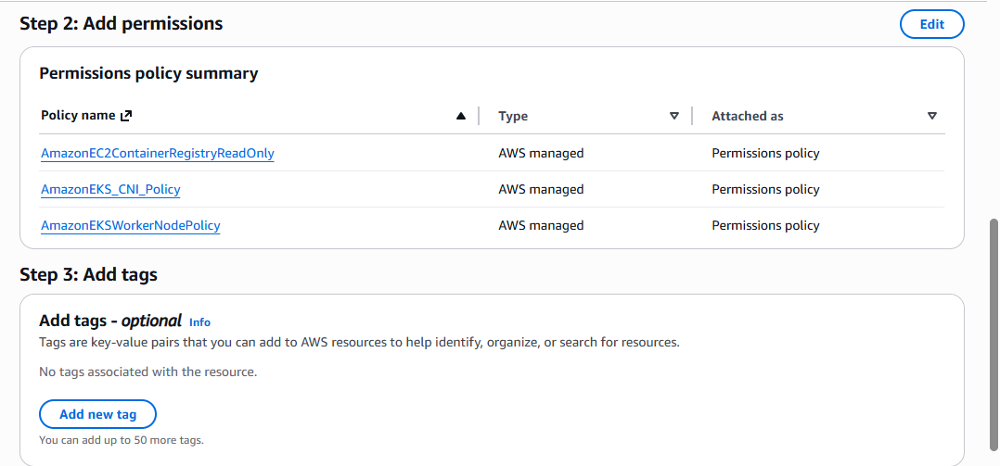```


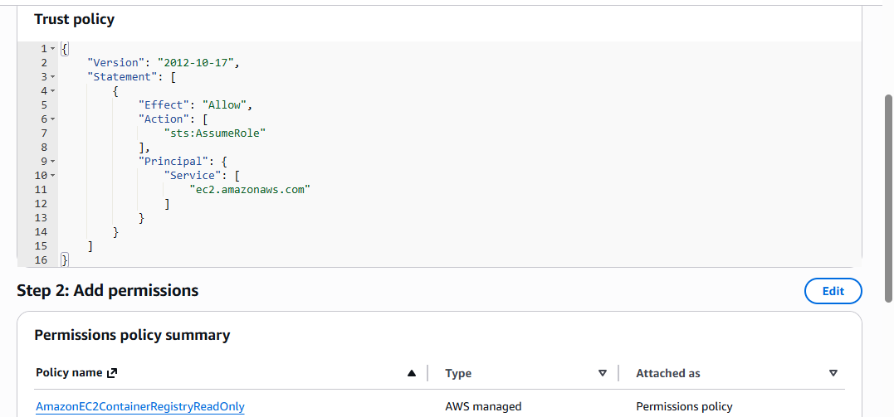### View Logs


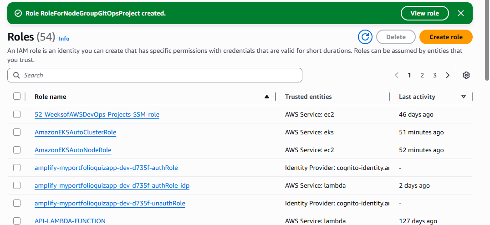```bash

kubectl logs -f deployment/tetris-deployment

#### 2.3 Node Group Configuration```


Configure instance settings:### Verify Service

- **Instance Type**: t3.medium or t3.small

- **Desired Size**: 1 node (for this tutorial)```bash

- **Min Size**: 1kubectl describe svc tetris-service

- **Max Size**: 3```


**[INSERT SCREENSHOT: Node Group Instance Configuration]**## Cleanup


#### 2.4 Node Group Creation CompleteRemove all resources:


Your cluster now has an active node:```bash

kubectl delete -f manifest/

**[INSERT SCREENSHOT: Node Group Active Status]**```


---## Deployment Success


### Step 3: Configure kubectl### Tetris Game Deployment


#### 3.1 Update kubeconfigThe following screenshots show the successful deployment of the Tetris game on Kubernetes:


After the cluster and node group are ready, configure kubectl to communicate with your cluster:


```bash

# Configure AWS credentials

aws configure


# Update kubeconfig to connect to your EKS cluster

aws eks update-kubeconfig --region us-east-1 --name tetris-cluster

```### ArgoCD Interface


#### 3.2 Verify Cluster ConnectionArgoCD monitoring and syncing the Tetris application:


Verify that kubectl is properly configured:


```bash

# Check cluster info

kubectl cluster-info


# Get cluster nodes

kubectl get nodes


# List all namespaces

kubectl get namespaces

```

## GitOps Best Practices

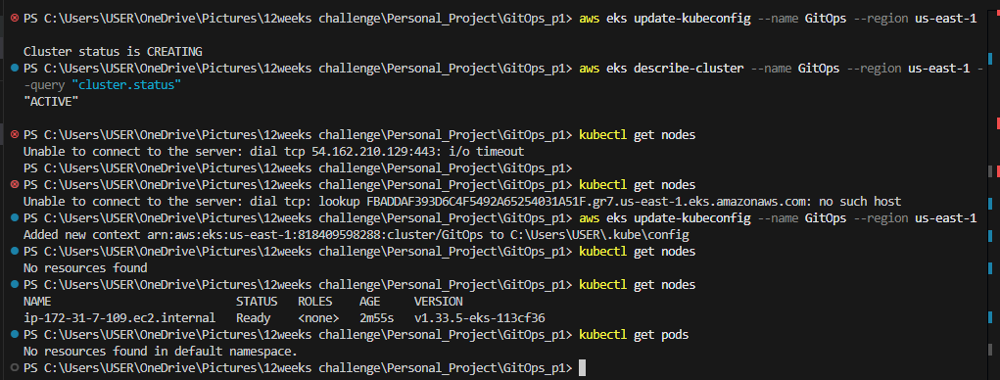

This project follows GitOps principles:

#### 3.3 Verify Node Status- **Declarative Configuration**: All infrastructure defined in YAML manifests

- **Version Control**: Configuration tracked in Git

Ensure your node is in a `Ready` state:- **Single Source of Truth**: Manifests are the authoritative state

- **Automated Deployment**: Apply changes via GitOps operators (ArgoCD, Flux, etc.)

```bash

kubectl get nodes -w## Future Enhancements

```

- Add Ingress configuration for custom domain support

---- Implement HorizontalPodAutoscaler for dynamic scaling

- Add persistent storage for game state

### Step 4: Install ArgoCD- Configure resource requests and limits

- Add health checks (liveness and readiness probes)

#### 4.1 Create ArgoCD Namespace- Implement network policies for security


Create a dedicated namespace for ArgoCD:## License


```bashThis project is part of the 12-week challenge personal project series.

# Create the argocd namespace

kubectl create namespace argocd## Author


# Verify namespace creationsamuel-nartey

kubectl get namespace argocd

```## References


#### 4.2 Install ArgoCD using Helm (Recommended)- [Kubernetes Documentation](https://kubernetes.io/docs/)

- [GitOps Best Practices](https://www.gitops.tech/)

The easiest way to install ArgoCD is using Helm:- [Tetris Game](https://en.wikipedia.org/wiki/Tetris)


```bash---

# Add ArgoCD Helm repository

helm repo add argocd https://argoproj.github.io/argo-helm**Last Updated**: November 11, 2025

helm repo update

# Install ArgoCD in the argocd namespace
helm install argocd argocd/argo-cd --namespace argocd
```

#### 4.3 Alternative: Install ArgoCD using kubectl

If you prefer using kubectl manifests:

```bash
# Install ArgoCD
kubectl apply -n argocd -f https://raw.githubusercontent.com/argoproj/argo-cd/stable/manifests/install.yaml

# Verify ArgoCD deployment
kubectl get deployments -n argocd
kubectl get pods -n argocd
```

#### 4.4 Verify ArgoCD Installation

Check if all ArgoCD components are running:

```bash
# List all ArgoCD pods
kubectl get pods -n argocd

# Check ArgoCD services
kubectl get svc -n argocd

# Expected output should show:
# - argocd-server
# - argocd-repo-server
# - argocd-controller-manager
```

**[INSERT SCREENSHOT: ArgoCD Pods Running]**

---

### Step 5: Access ArgoCD Dashboard

#### 5.1 Port Forward to ArgoCD Server

Access the ArgoCD dashboard using port forwarding:

```bash
# Forward local port 8080 to ArgoCD server
kubectl port-forward svc/argocd-server -n argocd 8080:443
```

#### 5.2 Get Initial Admin Password

Retrieve the default admin password:

```bash
# Get the initial admin password
kubectl get secret argocd-initial-admin-secret -n argocd -o jsonpath="{.data.password}" | base64 -d

# On Windows PowerShell:
kubectl get secret argocd-initial-admin-secret -n argocd -o jsonpath="{.data.password}" | base64 -d; echo
```

#### 5.3 Login to ArgoCD

Open your browser and navigate to: `https://localhost:8080`

- **Username**: admin
- **Password**: [Use the password from Step 5.2]

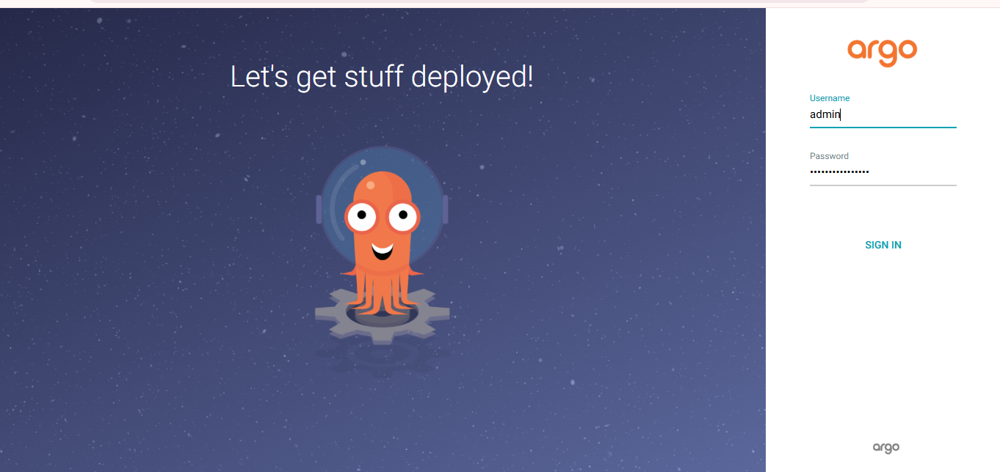

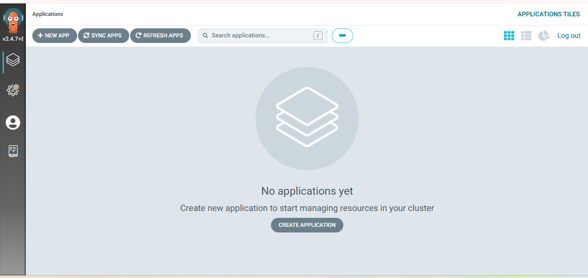

#### 5.4 Change Default Password

Once logged in, change the admin password:

1. Click on **Settings** (gear icon)
2. Navigate to **Accounts**
3. Click **Update Password**
4. Enter your new secure password

---

### Step 6: Connect GitHub Repository

#### 6.1 Create GitHub Repository Connection

Connect your GitHub repository to ArgoCD:

1. Go to **Settings** → **Repositories** in ArgoCD dashboard
2. Click **Connect Repo**
3. Select **VIA HTTPS** or **VIA SSH** (HTTPS recommended for simplicity)

**[INSERT SCREENSHOT: Connect Repository Screen]**

#### 6.2 Enter Repository Details

Provide your repository information:

```
Repository URL: https://github.com/samuel-nartey/GitOpsTetrisProject
```

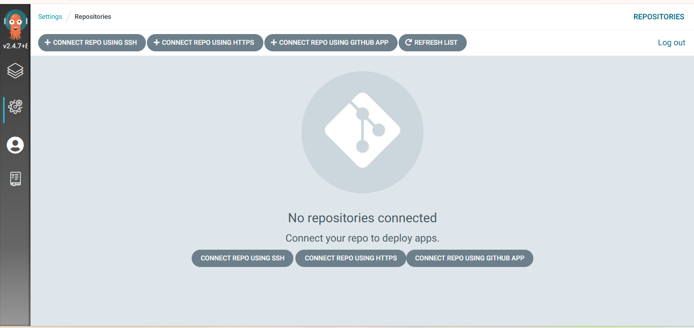

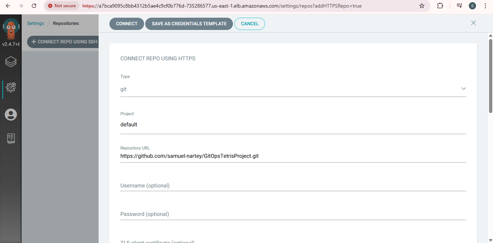

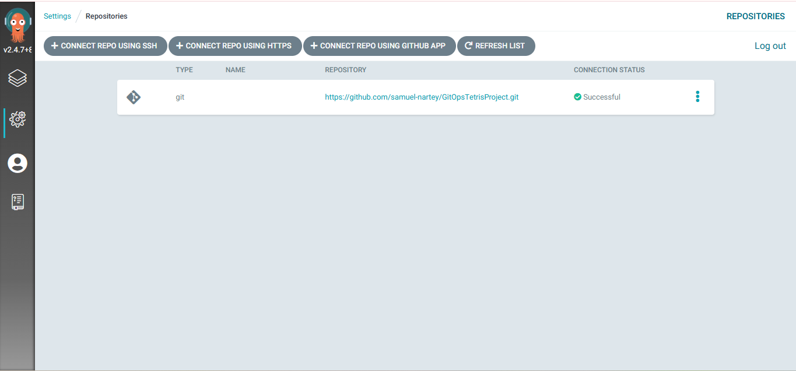

#### 6.3 Verify Repository Connection

Once connected, you should see your repository in the repositories list:

**[INSERT SCREENSHOT: Repository Connected Successfully]**

---

### Step 7: Create ArgoCD Application

#### 7.1 Create New Application

Create an ArgoCD Application to deploy the Tetris game:

1. Click **+ NEW APP** on the ArgoCD dashboard
2. Fill in the application details

**Application Configuration:**

```
Application Name: tetris-app
Project Name: default
Sync Policy: Automatic

Source:
  Repository URL: https://github.com/samuel-nartey/GitOpsTetrisProject
  Revision: main
  Path: manifest

Destination:
  Cluster: https://kubernetes.default.svc (in-cluster)
  Namespace: default
```

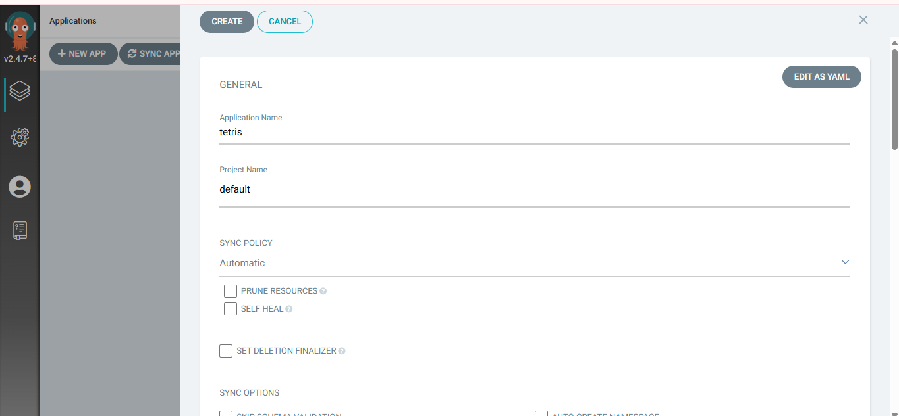

#### 7.2 Configure Sync Settings

Set up automatic synchronization:

```yaml
Sync Policy: Automatic
Auto-Prune: Enabled
Self-Heal: Enabled
```

This ensures ArgoCD automatically:
- Syncs changes from Git to the cluster
- Removes resources deleted from Git
- Reconciles drift between Git and cluster

**[INSERT SCREENSHOT: Sync Policy Configuration]**

#### 7.3 Create the Application

Click **CREATE** to deploy the application:

**[INSERT SCREENSHOT: Application Creation Complete]**

---

### Step 8: Verify Deployment

#### 8.1 Monitor Application Sync

Watch the ArgoCD dashboard as it syncs your application:


#### 8.2 Verify Kubernetes Deployment

Check the deployment status in your cluster:

```bash
# List deployments
kubectl get deployments

# List services
kubectl get services

# List pods
kubectl get pods

# Describe tetris service
kubectl describe svc tetris-service

# Get service external IP
kubectl get svc tetris-service -o jsonpath='{.status.loadBalancer.ingress[0].hostname}'
```

#### 8.3 Application Deployment Success

Your application is now deployed and running:


#### 8.4 Access the Tetris Game

Get the external IP/hostname and access the Tetris game:

```bash
# Get LoadBalancer external IP
kubectl get svc tetris-service

# Access at: http://<EXTERNAL-IP>
```

---

## ArgoCD Dashboard Guide

### Dashboard Overview

The ArgoCD dashboard displays all your applications and their deployment status:


### Application Card Details

Each application card shows:

- **Application Name**: tetris-app
- **Sync Status**: 
  - 🟢 **Synced**: Git and cluster state match perfectly
  - 🟡 **OutOfSync**: Changes detected, waiting to sync
  - 🔴 **Error**: Issues detected during sync
- **Health Status**:
  - 🟢 **Healthy**: All pods running normally
  - 🟡 **Progressing**: Resources are being created/updated
  - 🔴 **Unhealthy**: Pods or services have issues

### Application Details View

Click on the application to see detailed information:


### Resource Tree

The resource tree shows all Kubernetes resources managed by this application:

**What's Displayed:**
- **Deployment**: tetris-deployment with 2 replicas
- **Service**: tetris-service (LoadBalancer)
- **Pods**: Individual pod instances
- **ReplicaSets**: Manages pod replicas

**Relationships:**
```
Application (tetris-app)
  ├── Deployment (tetris-deployment)
  │   ├── ReplicaSet
  │   │   ├── Pod 1 (tetris-deployment-xxxxx)
  │   │   └── Pod 2 (tetris-deployment-yyyyy)
  └── Service (tetris-service)
```


### Pod Status and Logs

Access individual pod information:

```bash
# View pod logs
kubectl logs pod/tetris-deployment-xxxxx

# Describe pod
kubectl describe pod/tetris-deployment-xxxxx

# Get pod events
kubectl get events -n default
```


### Sync Management

#### Manual Sync

If auto-sync is disabled, manually sync by:
1. Click the **SYNC** button on the application card
2. Review changes
3. Click **SYNCHRONIZE**

#### Sync Status Indicators

- **Status**: Shows current sync state
- **Last Sync**: Time of last synchronization
- **Next Sync**: If auto-sync is scheduled

### Application History

View deployment history:
1. Click on the application
2. Navigate to **HISTORY** tab
3. View all previous syncs and deployments
4. Rollback to previous versions if needed

### Repository Information

View repository and revision details:
- **Repository**: Your Git repository URL
- **Branch**: main
- **Path**: manifest/
- **Current Commit**: Latest commit hash being deployed

---

## Project Structure

```
GitOpsTetrisProject/
├── README.md                          # This comprehensive guide
├── manifest/
│   ├── tetris-deploy.yaml            # Kubernetes Deployment manifest
│   │   └── Defines 2 replicas of tetris-v2 image
│   │   └── Exposes port 80
│   └── tetris-svc.yaml               # Kubernetes Service manifest
│       └── LoadBalancer service
│       └── Routes traffic to deployment pods
└── Screenshots/                       # Documentation images
    ├── ArgoCDP1.drawio.png           # Architecture diagram
    ├── EKS*.png                      # EKS cluster setup screenshots
    ├── argocd*.png                   # ArgoCD dashboard screenshots
    └── tetrisgamedeployed*.png       # Deployment success screenshots
```

### Manifest Details

#### tetris-deploy.yaml

```yaml
apiVersion: apps/v1
kind: Deployment
metadata:
  name: tetris-deployment
spec:
  replicas: 2          # Two instances of the game
  selector:
    matchLabels:
      app: tetris      # Selector for pod labeling
  template:
    metadata:
      labels:
        app: tetris
    spec:
      containers:
        - name: tetris
          image: nasi101/tetrisv2   # Docker image
          ports:
            - containerPort: 80     # Container port
```

#### tetris-svc.yaml

```yaml
apiVersion: v1
kind: Service
metadata:
  name: tetris-service
spec:
  selector:
    app: tetris          # Matches deployment pods
  ports:
    - protocol: TCP
      port: 80           # External port
      targetPort: 80     # Container port
  type: LoadBalancer    # External access via AWS NLB/ALB
```

---

## Kubernetes Commands Reference

### Cluster Information

```bash
# Get cluster info
kubectl cluster-info

# Get nodes
kubectl get nodes

# Describe a node
kubectl describe node <node-name>
```

### Deployments

```bash
# List deployments
kubectl get deployments

# Get deployment details
kubectl describe deployment tetris-deployment

# Scale deployment
kubectl scale deployment tetris-deployment --replicas=3

# Update deployment image
kubectl set image deployment/tetris-deployment tetris=nasi101/tetrisv2:latest
```

### Services

```bash
# List services
kubectl get services

# Get service details
kubectl describe svc tetris-service

# Get external IP
kubectl get svc tetris-service -o jsonpath='{.status.loadBalancer.ingress[0].hostname}'
```

### Pods

```bash
# List pods
kubectl get pods

# Get pod details
kubectl describe pod <pod-name>

# View pod logs
kubectl logs <pod-name>

# Tail logs in real-time
kubectl logs -f <pod-name>

# Execute command in pod
kubectl exec -it <pod-name> -- /bin/bash
```

### Namespaces

```bash
# List namespaces
kubectl get namespaces

# Create namespace
kubectl create namespace my-namespace

# List resources in namespace
kubectl get all -n argocd
```

### ArgoCD Specific

```bash
# List ArgoCD pods
kubectl get pods -n argocd

# Get ArgoCD services
kubectl get svc -n argocd

# Port forward ArgoCD
kubectl port-forward svc/argocd-server -n argocd 8080:443

# Get admin password
kubectl get secret argocd-initial-admin-secret -n argocd -o jsonpath="{.data.password}" | base64 -d
```

---

## Testing GitOps: Making Changes

### 8.1 Update Application Version

Test GitOps by updating the application version:

1. Edit `manifest/tetris-deploy.yaml`:

```yaml
containers:
  - name: tetris
    image: nasi101/tetrisv2:v2  # Update the tag
```

2. Commit and push to Git:

```bash
git add manifest/tetris-deploy.yaml
git commit -m "feat: updated tetris to version 2"
git push origin main
```

3. Watch ArgoCD sync the changes automatically (if auto-sync enabled):

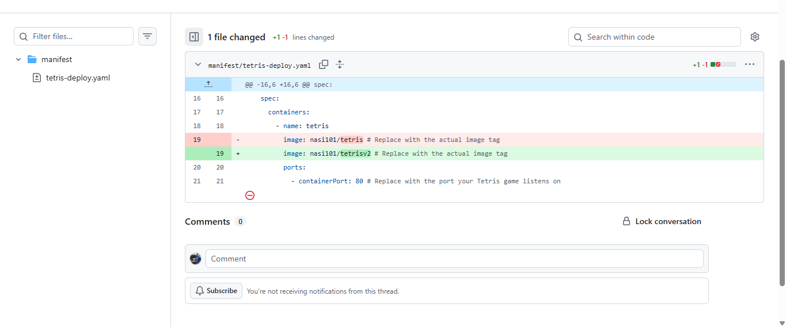

### 8.2 View Changes in ArgoCD

In the ArgoCD dashboard, you'll see:
- **OutOfSync** status appears
- **Diff** shows the image version change
- **SYNC** button becomes available
- After sync, application updates automatically

---

## Troubleshooting

### ArgoCD Issues

#### ArgoCD Server Not Accessible

```bash
# Check if ArgoCD pods are running
kubectl get pods -n argocd

# Check ArgoCD service
kubectl get svc -n argocd

# Port forward if needed
kubectl port-forward svc/argocd-server -n argocd 8080:443
```

#### Cannot Connect to Repository

```bash
# Check repository connection
kubectl logs -n argocd -l app.kubernetes.io/name=argocd-repo-server

# Verify GitHub credentials are correct
# Reconnect repository in ArgoCD settings
```

### Deployment Issues

#### Pods Not Running

```bash
# Check pod status
kubectl describe pod <pod-name>

# Check pod events
kubectl get events

# View pod logs
kubectl logs <pod-name>
```

#### Service External IP Pending

```bash
# Check service status
kubectl describe svc tetris-service

# Wait for AWS to provision load balancer
# This typically takes 2-5 minutes
kubectl get svc tetris-service -w
```

### Kubernetes Issues

#### Node Not Ready

```bash
# Check node status
kubectl get nodes

# Describe problematic node
kubectl describe node <node-name>

# Check node logs (via SSH or EC2 console)
```

#### Insufficient Resources

```bash
# Check cluster resources
kubectl describe nodes

# Add more nodes to node group or increase instance size
```

---

## Best Practices

### GitOps Principles

1. **Git as Source of Truth**
   - All configurations in Git
   - No manual kubectl apply commands on production
   - Every change tracked and auditable

2. **Declarative Infrastructure**
   - Define desired state in YAML
   - Let GitOps operators enforce that state
   - Automatic drift detection and correction

3. **Automated Deployment**
   - Set auto-sync for production readiness
   - Pipeline integrates with Git workflows
   - Zero-downtime deployments possible

4. **Version Control**
   - All changes tracked with git history
   - Easy rollbacks to previous versions
   - Clear audit trail for compliance

### Security Best Practices

1. **Change Default Credentials**
   - Always change ArgoCD admin password
   - Use strong, unique passwords

2. **RBAC Configuration**
   - Implement role-based access control
   - Limit service account permissions
   - Use separate service accounts per application

3. **Repository Security**
   - Use SSH keys for private repositories
   - Enable branch protection rules
   - Require pull request reviews

4. **Secret Management**
   - Never commit secrets to Git
   - Use tools like AWS Secrets Manager or HashiCorp Vault
   - Implement secret scanning in CI/CD

### Resource Management

1. **Resource Requests and Limits**
   ```yaml
   resources:
     requests:
       memory: "64Mi"
       cpu: "250m"
     limits:
       memory: "128Mi"
       cpu: "500m"
   ```

2. **Horizontal Pod Autoscaling**
   ```yaml
   apiVersion: autoscaling/v2
   kind: HorizontalPodAutoscaler
   metadata:
     name: tetris-hpa
   spec:
     scaleTargetRef:
       apiVersion: apps/v1
       kind: Deployment
       name: tetris-deployment
     minReplicas: 2
     maxReplicas: 10
     metrics:
     - type: Resource
       resource:
         name: cpu
         target:
           type: Utilization
           averageUtilization: 70
   ```

---

## Future Enhancements

- [ ] Add Ingress for custom domain
- [ ] Implement HorizontalPodAutoscaler for auto-scaling
- [ ] Add persistent storage for game state
- [ ] Configure resource requests and limits
- [ ] Add liveness and readiness probes
- [ ] Implement network policies for security
- [ ] Set up monitoring with Prometheus
- [ ] Add logging with CloudWatch/ELK
- [ ] Implement CI/CD pipeline
- [ ] Add multi-environment deployments (dev, staging, prod)

---

## Additional Resources

### Official Documentation

- [AWS EKS Documentation](https://docs.aws.amazon.com/eks/)
- [Kubernetes Documentation](https://kubernetes.io/docs/)
- [ArgoCD Documentation](https://argo-cd.readthedocs.io/)
- [GitOps Best Practices](https://www.gitops.tech/)

### Useful Tools

- [kubectl Cheat Sheet](https://kubernetes.io/docs/reference/kubectl/cheatsheet/)
- [ArgoCD CLI Reference](https://argo-cd.readthedocs.io/en/stable/cli_installation/)
- [AWS CLI Reference](https://docs.aws.amazon.com/cli/latest/userguide/)

### Learning Resources

- [Kubernetes by Example](https://www.kubernetesbyexample.com/)
- [ArgoCD Tutorial](https://argo-cd.readthedocs.io/en/stable/getting_started/)
- [GitOps with ArgoCD](https://www.digitalocean.com/community/tutorials/how-to-deploy-to-kubernetes-with-argocd-and-gitops)

---

## License

This project is part of the 12-week challenge personal project series.

## Author

**samuel-nartey**

Repository: [GitOpsTetrisProject](https://github.com/samuel-nartey/GitOpsTetrisProject)

---

## Version History

| Version | Date | Changes |
|---------|------|---------|
| 1.0 | November 12, 2025 | Initial comprehensive setup guide with EKS and ArgoCD |

---

**Last Updated**: November 12, 2025

**Status**: ✅ Complete - Ready for Production Use
